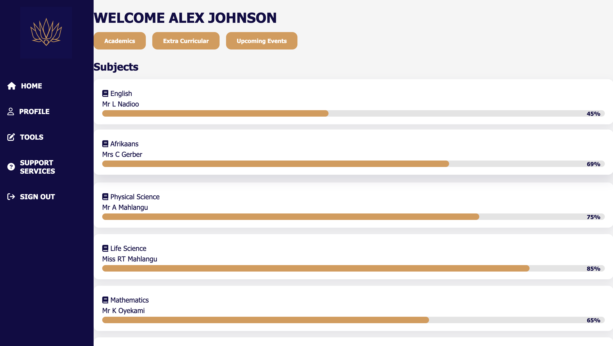

# 🌟 Empiras Student Portal

---

## 🎯 Overview

The **Empiras Student Portal** is a modern, responsive web portal for **students, parents, and teachers**, designed and developed as a **team project** for the **AFRIHACK CONNECT** competition.  
It provides a realistic school management environment with dashboards, academic tracking, notifications, messaging, and fee management.

Built with **HTML, CSS, JavaScript, TailwindCSS**, and JSON-based data simulation, this project demonstrates strong frontend and interactive web development skills.

---

## Screenshots of the Project

  
   
  **Figure 1:** Screenshot of the login page

  
   
  **Figure 2:** Screenshot of the student dashboard

---
## 🚀 Features

### 👩‍🎓 Student Dashboard
- Dynamic academic performance tracking with **progress bars**.
- View **extra-curricular activities**.
- Check **upcoming school events**.
- Messaging system to communicate with teachers.
- Fee notifications for unpaid tuition.

### 👨‍👩‍👧 Parent Dashboard
- Access child’s academic grades & activities.
- Send messages (complaints, grievances, or meeting requests) to teachers.
- View **notifications in real-time** using WebSockets.
- Receive guidance on fee payments.

### 👩‍🏫 Teacher Dashboard
- Manage student classes & subjects.
- Track student grades and activities.
- Send notifications to students and parents.
- Real-time messaging integration.

---

## 💻 Tech Stack & Skills
- **Frontend:** HTML5, CSS3, JavaScript  
- **UI/UX:** TailwindCSS, Font Awesome, Google Material Icons  
- **Data:** JSON simulation for users, grades, and notifications  
- **Realtime:** WebSocket messaging system  
- **Responsive Design:** Mobile-first, fully adaptive layouts  
- **Animations & Effects:** Smooth hover transitions, progress bars, and dashboard animations  

---

## 🏆 Awards & Recognition

I was personally honored with the **“Most Promising Award”** at the **AFRIHACK CONNECT** competition! 🎉

This recognition highlights:

- **Innovation & Creativity:** My contributions in designing and developing features like interactive dashboards, real-time messaging, and virtual file system simulation.  
- **Technical Skills:** Hands-on experience with **HTML, CSS, JavaScript**, and advanced frontend techniques including **Tailwind-inspired responsive styling** and **dynamic content updates**.  
- **Impactful Problem Solving:** Developing solutions that address real-world educational challenges, such as academic progress tracking, notifications, and parent-student communication.  
- **Professional Growth:** The award reflects my ability to take initiative, learn new technologies quickly, and deliver high-quality software under competition pressure.

This recognition motivates me to continue creating **innovative and user-friendly tech solutions** in the educational technology space.

